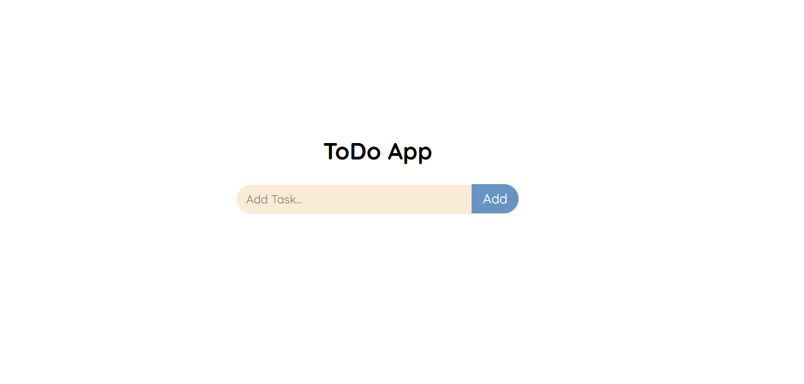
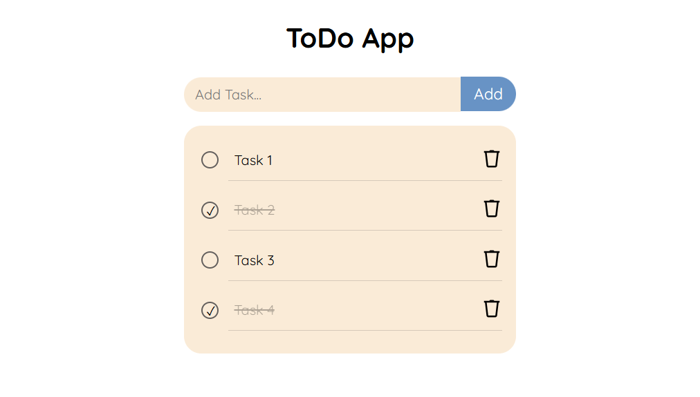

# Todo App - JavaScript

This is a simple Todo app built with vanilla JavaScript. It allows users to add, complete, and delete tasks from a list.

## Features

- Add tasks to the list
- Mark tasks as completed with a checkbox
- Delete tasks from the list
- User feedback (alert on successful task addition)

## Usage

1. Clone the repository:
   ```bash
   git clone https://github.com/your-username/todo.git
   ```

2. Open `index.html` in your browser to run the app.
3. Use the input field and "Add Task" button to add tasks.
4. Mark tasks as completed by checking the checkbox.
5. Delete tasks by clicking the trash icon.

### Screenshot




## How It Works

- **Add Task**: Enter text and click "Add Task" to add a task.
- **Mark as Completed**: Check the box to mark a task as completed (strikes through text).
- **Delete Task**: Click the trash icon to remove a task.
